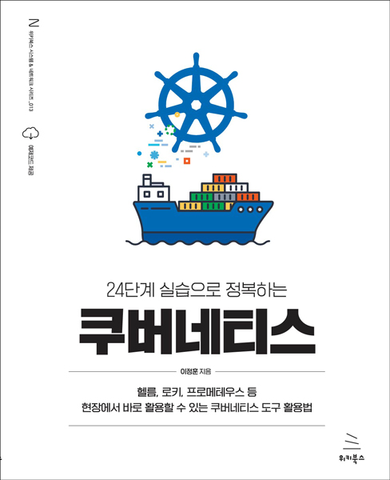

# 24단계 실습으로 정복하는 쿠버네티스
### 헬름, 로키, 프로메테우스 등 현장에서 바로 활용할 수 있는 쿠버네티스 도구 활용법

- 이정훈 지음
- 28,000원 | 2022년 11월 10일 발행 | 492쪽
- [책 홈페이지](https://wikibook.co.kr/kubepractice/)
- [도서 미리보기](http://www.yes24.com/Product/Viewer/Preview/115187666)
- [도서 관련 문의](https://wikibook.co.kr/support/contact/)

---

**실무 현장의 경험을 고스란히 담은 쿠버네티스 실습서!**

직접 해야만 알 수 있는 것들이 있습니다. 쿠버네티스도 마찬가지입니다. 쿠버네티스의 기반이 되는 컨테이너 기술은 기존의 가상 머신과 기본 전제부터 다릅니다. 실습으로 한땀한땀 채워나가면 처음에는 어렵고 낯설지만 금방 쿠버네티스에 익숙해질 수 있습니다.

실무에서는 쿠버네티스뿐만 아니라 네트워크, 스토리지, 모니터링, 리포지토리 등 다양한 쿠버네티스 도구가 함께 사용됩니다. 이 책은 총 24개의 장으로 구성돼 있고, 각 장마다 다양한 실습을 진행합니다. 완전한 서비스를 제공하기 위해 필요한 모든 요소를 제공하며, 특히 퍼블릭 클라우드 환경뿐만 아니라 온프레미스 환경에서도 사용할 수 있는 다양한 예제를 다룹니다. 벤더가 제공하는 퍼블릭 클라우드에 비해 온프레미스 환경은 관련 자료를 찾기 어려운데, 저자가 경험한 내용을 빠짐없이 담았습니다.

---
 
 ## 구입처
 
 - [예스24](http://www.yes24.com/Product/Goods/115187666)
 - [교보문고](https://product.kyobobook.co.kr/detail/S000200152893)
 - [인터파크](https://book.interpark.com/product/BookDisplay.do?_method=detail&sc.prdNo=355889205)
 - [알라딘](https://www.aladin.co.kr/shop/wproduct.aspx?ItemId=304282680)

---

## 본문 URL

본문에 등장하는 URL을 입력 및 참고할 수 있도록 다음 파일에 정리했습니다.

- [URL 목록](urls.md)
